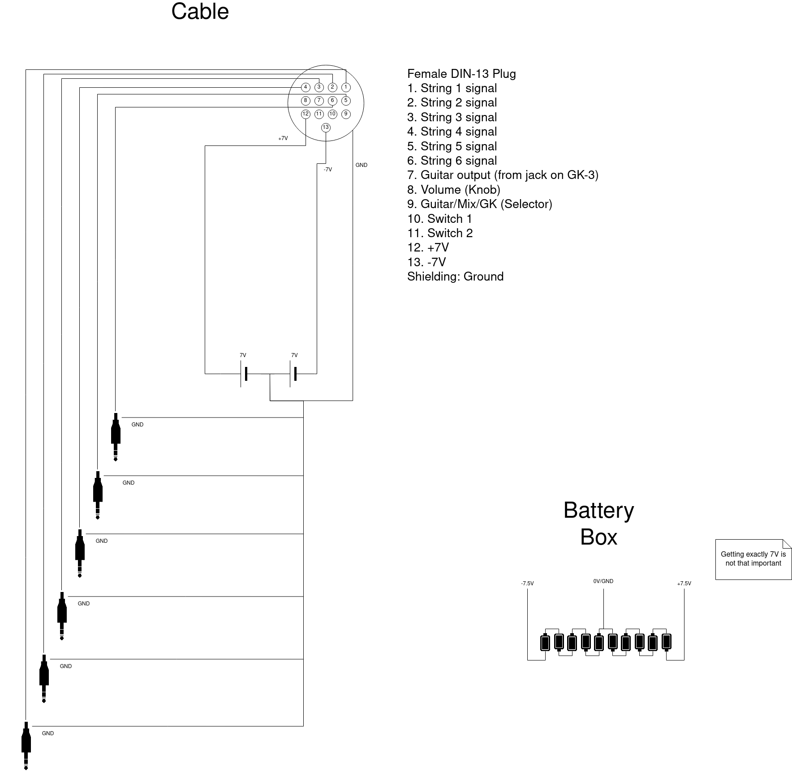
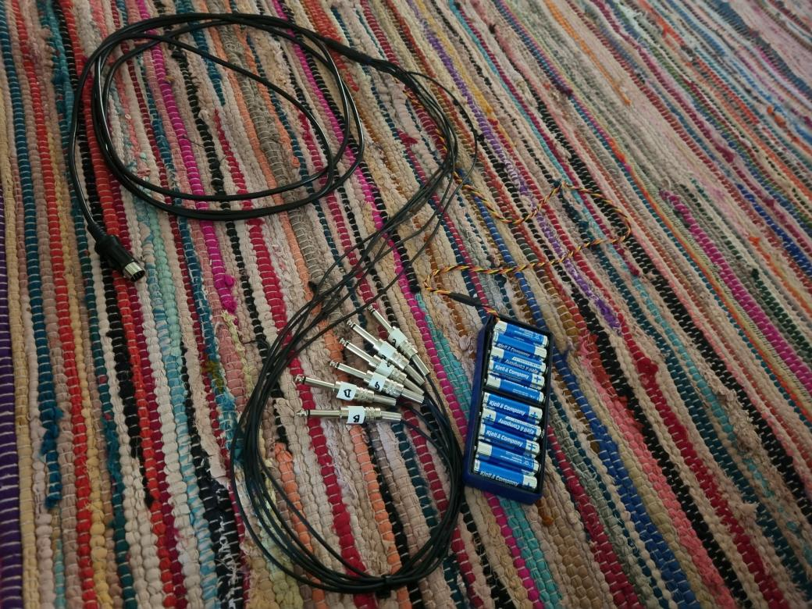

## Motivation
Guitars are pretty analog, even electric guitars. You can apply effects, but you can never really dig into the sound the way you can with a digital synth. What if you want to delete the third harmonic, or have it play some exotic scale that is decidedly incompatible with the western 12 tone system? What if you wanted to replace the meat of the sound with that of a synthesizer while keeping the distinct sound that comes with a guitar and the fact that you're plucking strings?

Some guitar synths exist on the market today, but they either sound very sterile, or rely on proprietary technology, making them unsuitable for experimentation. 

## Solution Sketch
1. Separate the sound coming from each string
2. Detect the pitch of the note being played on each string
3. Break sound down into spectrum (FFT)
4. Either generate sound based on the pitch, volume, and frequency distribution of each string, modify the the sound based on some rule resulting in pitch shifts, filtering, or some combination thereof

## 1. Separating the Strings
To accomplish breaking down the sound of a guitar completely into its components, one first needs to separate the sound of each string from that of the others. This is somewhat possible using software like Melodyne, but it doesn't really work in real time. The first iteration of this software tried to separate out the strings from one another using ready made components, but one runs into issues such as "the first harmonic of the E string has the same frequency as the fundamental of the D string, how can I tell which amount of energy came from which string?". This is possible to mitigate by tuning the strings to frequencies which are not divisible or close to divisible by one another, but the end result will never really be good.

Existing guitar synthesizers use one pickup per string, and so does this software. In fact, it uses the hardware from the Roland guitar synths, the GK-3. This is billed as a "MIDI" pickup, but it actually outputs raw signal from the strings. While the schematics are not available from Roland, the pin outs are available online. 

Not being very familiar with electronics, I had a hard time fully comprehending what was going on when people talked about cables like this one (Is it +7V and -7V for 14V total? What is "ground" in this context?), so here is the most idiot proof schematic I could make. This setup is exactly what I have.


  

## 2. Pitch Tracking
Now that the signals are entering the sound card one by one, it is time to do pitch detection and spectral analysis. I have tried a few different things for real time pitch tracking (in general, hard!). The main issue here is to keep latency low, but still have reliable pitch detection. The obvious solution is to use FFT to generate a spectrum and some combination of rules applied to said spectrum to determine what the pitch is. The problem with this is that latency matters, a lot. FFT breaks a sample down into a "harmonic series" with the fundamental having the same wavelength as the sample's total length (the sample that the analysis is being performed on). This works well for most anything but very short samples. When the frequency we are interested in (the fundamental of the string) is approximately the size of the the sample length (and we want to use as short of a sample as possible, due to latency, but we won't get below 1 period), it doesn't perform very well. There's a number of things one can do to such as windowing, but all in all FFT is not ideal for this application.

### 1.1 SNAC
Pitch detection algorithms can be broken down into frequency domain and time domain algorithms, with time domain algorithms not suffering from some of the problems of FFT, but having issues of their own. Autocorrelation is a family of time domain algorithms where the signal is compared for similarity to a time shifted version of itself. When the shift is exactly one period, similarity ought to be the highest. Without going too much into the details that I do not fully understand myself, I have selected the SNAC algorithm due to it requiring only \~1.2 periods of sampled sound to make a determination of the pitch. With FFT one would have issues with boundary effects, and probably have to run multiple rounds of analysis while adjusting the input sample length, do windowing, and other tricks. 

SNAC has been implemented in PureData as `[helmholtz~]` by Katjav from the PureData forums and works surprisingly well for our purposes.  

### 1.2 FFT Sanity Check 
When pitch has been detected, we CAN use FFT. Since we now know the pitch, and therefore the wavelength, of the signal, we do not have to worry about boundary effects - we know that our sample will be exactly one period and therefore that the fundamental and all the harmonics will line up perfectly with the FFT size. The frequencies we are interested in will all have periods that are evenly divisible with the sample length - 1, 1/2, 1/3, etc. This should yield a good frequency spectrum with minimal artifacts.

We can also now, if we want to, use FFT to check the SNAC output value for octave errors - we may simply divide or multiply the period by two and check the resulting spectrum using any of the schemes from FFT pitch detection. One example of such a scheme is the harmonic product spectrum: Multiply together the coefficients of a fundamental and its harmonics. 

Sketch algorithm:
1. Produce FFT for the sample length we were given, and for twice or half that
2. Multiply together all of the coefficients, with weights if needed
3. Normalize?
4. Pick the stronger of the two candidates

Roughly, what we are doing is checking if there's a 2/3 "harmonic" (in fact, all odd harmonics for the doubled period) for the supposed pitch. If so, we may have an octave error (time domain algorithms are prone to selecting pitches that are twice or half of what the real pitch is). The nice thing about this two step process is that we gain the low latency of a time domain algorithm, but can use the tricks we would otherwise use in the frequency domain, such as the harmonic product spectrum.

```NOTE: The final scheme for this step has not yet been determined```

## 3. FFT
Turns out we've already done this in the last step :)

## 4. Making or modifying sound
Now that we have a frequency spectrum, what can we do with it?

First, looking back at the motivation
> What if you want to delete the third harmonic, or have it play some exotic scale that is decidedly incompatible with the western 12 tone system? What if you wanted to replace the meat of the sound with that of a synthesizer while keeping the distinct sound that comes with a guitar and the fact that you're plucking strings?

The character of a guitar is partly the sound a string makes when you strike it (the attack), partly the "spectral envelope", ie. how the fundamental and harmonics decay over time and relative to one another. Some of them will resonate better or worse, perhaps some will decay faster, or they are influenced by symphatetic vibration in another string - I don't know all the factors.

### Modifying sound
#### Simple harmonic manipulation
We can easily delete the third harmonic, and then simply run inverse FFT to obtain a natural guitar sound without it. We can also strenghthen some harmonics, even do things like swap the volume for the third and fourth harmonic. We can apply distortion to one of them if we want to. The possibilities just from having a *good* frequency domain decomposition are endless..

#### Harmonics that duck or fall in line
Suppose you're playing a very complex chord. The spectrum becomes very busy and it sound somewhat dissonant. Sometimes you want that, but most of the time (?) not. Dissonance comes from near, but not identical, pitches appearing in the sound at the same time. One thing we could do is to detect the chord being played, match it to a mode or scale (we can even set the key of the song and the modes to be used beforehand) and then take all the harmonics and force them to these frequencies. This will clear up the spectrum by a lot and is a very interesting possibility. Other schemes such as selecting the dominant note and having other harmonics "duck" for it (in the compressor sense of ducking) is also possible.

### Making sound
#### Pitch, Amplitude to Synth
This is the simplest case. Simply take the (fundamental) pitch and volume and feed it into a synth. This is already implemented in the repository, but it doesn't sound very good. It doesn't care about how you pluck the string.  
  
#### Spectral distribution becomes the filter
Taking the spectral distribution and mapping it to a filter ought to be the simplest improvement over the previous scheme in carrying some of the guitar's effects over. For example: Take the volume for each harmonic, subtract some constant, and have these become coefficients in the application of band-pass filters on the sound coming from the synth. This is the next thing to implement.

#### Difference against the expected spectral envelope
Suppose we want to play a guitar, have it sound like a synth in the normal case, and then modify the sound based on the *deviation* from that case. It may be easier understood in terms of an example: When you pick a string normally, it should sound like the synth of choice, but when you dampen it, the dampening should carry over. Can we achieve this?  
  
Yes! We can calibrate the program based on a normal spectral envelope, or perhaps many, and then take the current envelope and compare it to the "normal case". Based on this difference we can then apply filters (or something completely different than a filter - it's wide open) that retains the quality of your playing in the completely synthetic sound.

This will surely take some programming, but it is very much achievable. One could normalize against a set frequency distribution, one per string, one per note per string, and one can take time since the note was played into account. Perhaps the best way to do it would be to collect data while the guitar is being played to continuously build a database of "decay cases" to figure out some sort of mean. One could also have the decay envelopes saved not based on *time* but on total volume decay since the note was picked instead. This would take care of the fact that maybe the sound does not decay the same for all attack strengths. There's a lot of different models possible here, only experimentation can determine which ones will sound good.

 ## Congratulations, you've built a truly digital guitar
 These are just some of the most obvious applications of real time pitch detection coupled with frequency domain decomposition (really, the main thing here is the low latency high precision FFT scheme). I believe there's a whole world of things to do, especially in using dynamic and nonlinear scales, which isn't really discussed much here. The freedom of turing a string pluck into such rich and meaningful data means you could do many many things I haven't even thought of.
 
 Attack detection is not really touched on here, I believe it's mostly a solved problem.